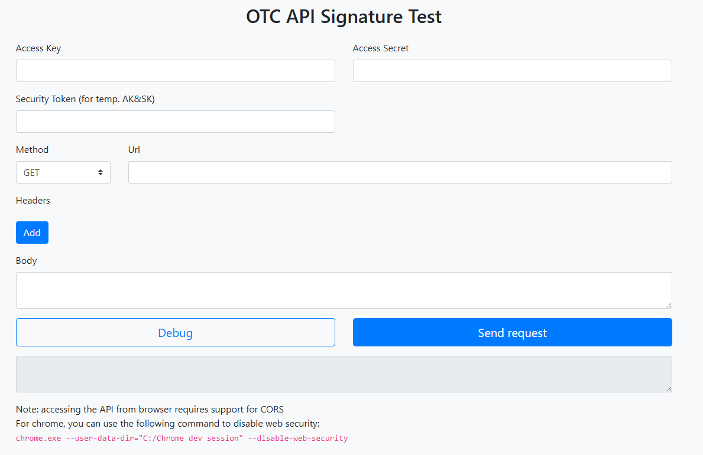

Test signing page
=================

.. toctree::
   :maxdepth: 3
   :includehidden:

Getting curl for an API request
-------------------------------
A simple HTML page is provided to demonstrate how to generate a signed API request.

Open the following URL in a browser (see note below):

.. code-block:: html
   :caption: api_signature_demo.html

    file://PATH_TO_FILE/api_signature_demo.html

in a browser with CORS disabled:

  

.. note:: 

   For security reasons, modern browsers enforce the Same-Origin Policy,
   which restricts how a document or script loaded from one origin can
   interact with resources from another origin.
   
   To test the signing page locally, you may need to disable CORS 
   (Cross-Origin Resource Sharing) in your browser.
   
   Please be cautious when doing this, as it can expose your browser to
   security risks.
   
   Make sure to re-enable CORS after testing.

   E.g. start chrome on Windows with following command:

    .. code-block:: shell
        :caption: Start Chrome with CORS disabled using Windows cmd

        chrome.exe --user-data-dir="C://Chrome dev session" --disable-web-security

Example usage
----------------

Querying FunctionGraph Functions API call
""""""""""""""""""""""""""""""""""""""""""

To generate a curl command to list all FunctionGraph functions in Project ``{your_project_id}`` in region eu-de, you can use the signing page as follows:
using `Querying Functions API call <https://docs.otc.t-systems.com/function-graph/api-ref/api/function_lifecycle_management/querying_functions.html>`_

set following parameters in the form:

- **Access Key**: ``{your_access_key}`` (AK)
- **Secret Key**: ``{your_secret_key}`` (SK)
- **Security Token**: ``{your_security_token}`` (if using temporary credentials, otherwise leave it empty)
- **Method**: GET
- **Url**: \https://functiongraph.eu-de.otc.t-systems.com/v2/{your_project_id}/fgs/functions 
  

Addd following headers:

- **Content-Type**: application/json
- **X-Project-Id**: ``{your_project_id}``

Then click the **Send request** button.

The curl command will be generated and displayed in the section below.

If the request is successful, you should see a response containing the list of functions
in your FunctionGraph project.

If you encounter CORS issues, copy the generated curl command and run it in your
terminal to get the response directly without CORS restrictions.
